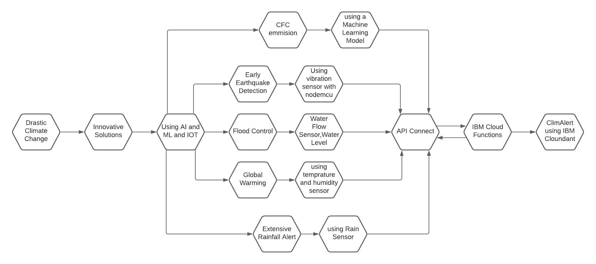

# Submission or project name
ClimAlert by The Bug Slayers
## Contents

  - [Submission or project name](#submission-or-project-name)
  - [Contents](#contents)
  - [Short description](#short-description)
    - [What's the problem?](#whats-the-problem)
    - [How can technology help?](#how-can-technology-help)
    - [The idea](#the-idea)
  - [Demo video](#demo-video)
  - [Long description](#long-description)
  - [Project roadmap](#project-roadmap)
  - [Built with](#built-with)
  - [Authors](#authors)
  - [License](#license)

## Short description

### What's the problem?
As we all know that nowdays our climate is being changing very drastically which leads to lot of loss to both wealth and mankind. 
A long term change in the earth's. Overall temperature with massive and ramfic causes
Climate changes causes lot of natural calamities such as 
1 Earthquake 
2 Floods 
3 Tsunami 
4 Global warming

### How can technology help?
As science is progressing each day . It helps us to deal with the problems occurring due to climate change .
We can use IOt , sensors to detect any natural calamities before its occurring and save mankind from great loss.

### The idea

It's inperative that learning and creating new things can help us to deal with the problems arise due to continue climate change.Providing new technologies ,backed by IBM cloud ,will enable us to deal with climate change causes

## Demo video

[![Watch the video] --------link-------

## Long description

[More detail is available here](docs/description.txt)

## Project roadmap

## Built with

- [IBM Cloudant](https://cloud.ibm.com/catalog?search=cloudant#search_results) - The NoSQL database used
- [IBM Cloud Functions](https://cloud.ibm.com/catalog?search=cloud%20functions#search_results) - The compute platform for handing logic
- [IBM API Connect](https://cloud.ibm.com/catalog?search=api%20connect#search_results) - The web framework used
- [Dropwizard](http://www.dropwizard.io/1.0.2/docs/) - The web framework used
- [Maven](https://maven.apache.org/) - Dependency management
- [ROME](https://rometools.github.io/rome/) - Used to generate RSS Feeds

## Authors
**Mayank Arora** [Mayank Arora](https://github.com/arora1mayank) ,
**Geetanshika Garg** [Geetanshika Garg](https://github.com/geetanshikagarg) ,
**Drishti Sharma** [Drishti Sharma](https://github.com/Drishti78/Drishti78)  ,
**Diksha Dahiya**[Diksha Dahiya](https://github.com/dahiya12)  ,
**Manik Chawla**[Manik Chawla](https://github.com/manikchawla12) .

## License

 See the [License](License.txt) file for details.
